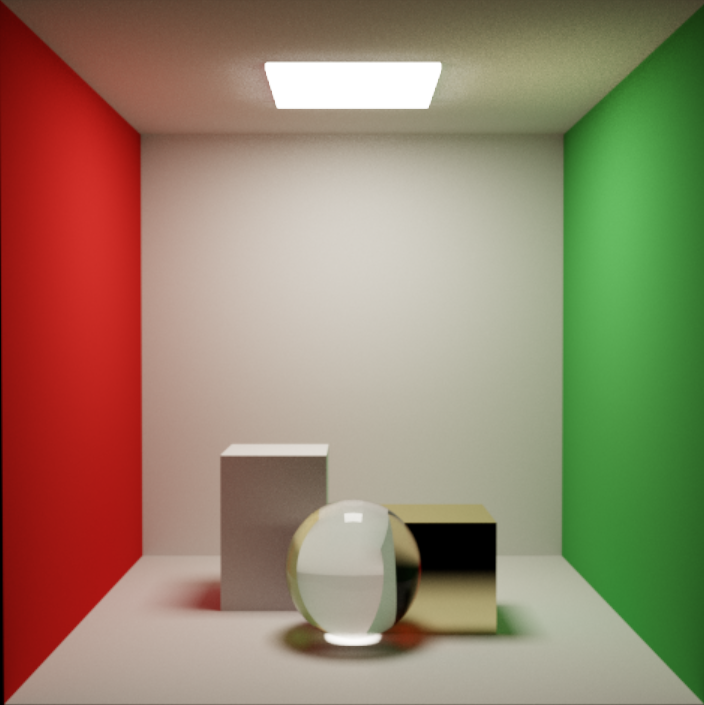
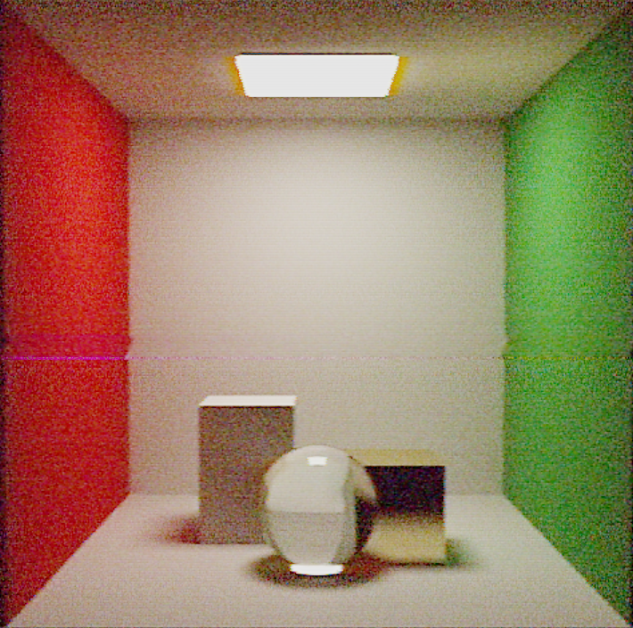

# RetroCam

A physically-based path tracer and VHS camcorder simulator. RetroCam renders scenes with a full Monte Carlo path tracing engine — complete with SPPM caustics, thin-lens optics, and an à-trous spatial denoiser — then passes the result through a 16-pass post-processing pipeline that reconstructs the analog signal chain of a consumer VHS camcorder at every stage, from CCD sensor noise to magnetic tape dropout.

> **Note:** This project is under active development. See the [Roadmap](#roadmap) for what is implemented and what is planned.

---


---

## Table of Contents

- [RetroCam](#retrocam)
  - [Table of Contents](#table-of-contents)
  - [Overview](#overview)
  - [Feature Highlights](#feature-highlights)
  - [Technical Deep Dive](#technical-deep-dive)
    - [Scene Representation](#scene-representation)
    - [BVH Acceleration Structure](#bvh-acceleration-structure)
    - [Path Tracer](#path-tracer)
    - [Thin-Lens Camera Model](#thin-lens-camera-model)
    - [SPPM Caustics](#sppm-caustics)
    - [À-Trous Spatial Denoiser](#à-trous-spatial-denoiser)
    - [VHS Post-Processing Pipeline](#vhs-post-processing-pipeline)
      - [p00 — Normalize](#p00--normalize)
      - [p01 — Luma Bandwidth Limit](#p01--luma-bandwidth-limit)
      - [p02 — Chroma Resolution Loss](#p02--chroma-resolution-loss)
      - [p03 — Color Matrix / Drift](#p03--color-matrix--drift)
      - [p04 — Dynamic Range / Tape Transfer Curve](#p04--dynamic-range--tape-transfer-curve)
      - [p07 — CCD Noise](#p07--ccd-noise)
      - [p08 — CCD Vertical Smear](#p08--ccd-vertical-smear)
      - [p09 — Chroma Bleed](#p09--chroma-bleed)
      - [p10 — Timebase Error](#p10--timebase-error)
      - [p11 — NTSC Dot Crawl](#p11--ntsc-dot-crawl)
      - [p12 — Tape Dropout](#p12--tape-dropout)
      - [p13 — Head-Switch Noise](#p13--head-switch-noise)
      - [p14 — Tracking Error](#p14--tracking-error)
      - [p15 — Edge Enhancement](#p15--edge-enhancement)
      - [p16 — Interlace](#p16--interlace)
  - [Screenshots](#screenshots)
  - [Getting Started](#getting-started)
    - [Prerequisites](#prerequisites)
    - [Platform Native Configuration](#platform-native-configuration)
    - [Building](#building)
    - [Running](#running)
  - [Controls](#controls)
    - [Orbit Camera](#orbit-camera)
    - [Free Camera (HFCS motion import active)](#free-camera-hfcs-motion-import-active)
  - [ImGui Settings Reference](#imgui-settings-reference)
  - [Project Structure](#project-structure)
  - [References and Sources](#references-and-sources)
  - [Roadmap](#roadmap)
  - [License](#license)

---

## Overview

RetroCam began as an experiment in combining physically accurate light transport simulation with analog signal degradation modeling. The premise is simple: render a scene correctly, then deliberately destroy it — the way a real VHS camcorder would.

The rendering engine is a GPU compute-shader path tracer running on OpenGL 4.3. It accumulates Monte Carlo samples progressively, so the image converges from noise toward a reference solution over time. On top of this, Stochastic Progressive Photon Mapping (SPPM) adds caustic light transport that path tracing alone handles poorly. The result is passed through an optional à-trous wavelet denoiser, then handed off to a 16-pass fragment shader pipeline that models — with physical basis — everything from VHS luma bandwidth loss to helical scan tracking error to CCD vertical smear.

The target output resolution is 854×480 (VHS SD, 16:9), rendered at 29.97 fps with 128 samples per frame for export.

---

## Feature Highlights

**Path Tracer**
- GPU compute path tracer with progressive accumulation (OpenGL 4.3, `pathtrace.comp`)
- SAH BVH acceleration structure built on the CPU, traversed on the GPU with a 64-entry stack
- Lambertian diffuse, metallic, rough specular (GGX perturbation), and transmissive/glass materials
- Next Event Estimation (NEE) with CDF-weighted area light sampling and firefly clamping
- PCG hash random number generator — per-channel independent seeds across frames
- Up to 6 path bounces per sample

**Optics**
- Physical thin-lens camera model: focal length (mm), f-stop, focus distance
- Polygon bokeh (N-gon aperture sampling via triangle fan decomposition)
- Spherical aberration: radially-weighted focal shift toward the lens edge
- Longitudinal chromatic aberration: per-channel (R/G/B) focal distance offsets
- Auto-focus lag: IIR exponential filter with Perlin-noise hunting oscillation

**Light Transport**
- SPPM caustics: up to 2,000,000 photons per iteration stored in a GPU spatial hash
- Lock-free photon insertion via `atomicExchange` linked-list chaining
- Radius schedule: `r_{n+1} = r_n × sqrt((n + α) / (n + 1))`

**Denoiser**
- À-trous (hole-punched) wavelet edge-stopping denoiser
- G-buffer driven: world-space normal + primary-hit depth as edge-stopping weights
- 1–5 sparse-kernel passes, step widths 1→2→4→8→16 px
- Auto-bypass above a configurable SPP threshold

**VHS Post-Processing**
- 16 individually toggleable passes, each physically motivated:
  `p01` luma bandwidth, `p02` chroma resolution, `p03` color matrix/drift, `p04` dynamic range, `p07` CCD noise, `p08` CCD smear, `p09` chroma bleed, `p10` timebase error, `p11` NTSC dot crawl, `p12` tape dropout, `p13` head-switch noise, `p14` tracking error, `p15` edge enhancement, `p16` interlace

**Scene and Export**
- Cornell box scene with boxes, spheres, and area lights; all tessellated to triangles
- Scene editor with live geometry and material editing
- Keyframe timeline: hermite-interpolated tracks for lens, exposure, saturation, tape age
- HFCS motion import: camera animation from HitFilm export data
- Render pipeline: frame-accurate export to JPEG sequences or MP4 via FFmpeg

---

## Technical Deep Dive

### Scene Representation

All geometry in the scene is ultimately expressed as a flat array of `GpuTriangle` objects. Each triangle stores three positions, three per-vertex normals, three UV pairs, and a material index. The in-memory layout is designed to match the GLSL `std430` struct exactly:

```java
// GpuTriangle.java — 128 bytes, 32 floats
// Matches GLSL:
//   struct Triangle {
//     vec3 v0; float pad0;  vec3 v1; float pad1;  vec3 v2; float pad2;  // 48 bytes
//     vec3 n0; float pad3;  vec3 n1; float pad4;  vec3 n2; float pad5;  // 48 bytes
//     vec2 uv0; vec2 uv1;  vec2 uv2; int matIndex; float pad6;          // 32 bytes
//   };
public static final int FLOATS_PER_TRIANGLE = 32;
```

Higher-level primitives (`Box`, `Sphere`) tessellate themselves into `GpuTriangle` lists during scene build. Smooth spheres use per-vertex normals interpolated at the hit point; box faces use flat normals.

Materials are a separate flat SSBO (`binding = 2`). The material struct supports albedo, emission strength, metallic, roughness, IOR, and a transmission factor for glass:

```glsl
struct Material {
    vec3  albedo;          float metallic;
    vec3  emission;        float emissionStrength;
    float roughness;       float ior;
    float transmission;    int   albedoTex;
    float p0; float p1; float p2; float p3;  // reserved
};
```

Emissive triangles are additionally extracted into a separate Light SSBO (`binding = 3`) that includes precomputed area, emission power, face normal, and a CDF weight for importance-weighted light selection.

---

### BVH Acceleration Structure

The BVH is constructed on the CPU in `BVHBuilder` using the Surface Area Heuristic (SAH) with 8 buckets per axis. The cost model follows the standard formulation:

```
C(split) = C_trav + (SA_left / SA_parent) × N_left × C_isect
                  + (SA_right / SA_parent) × N_right × C_isect
```

where `C_trav = 1.0` and `C_isect = 1.5`. Nodes with 4 or fewer triangles are always made leaves regardless of SAH. If the best split cost exceeds the leaf cost, the split is suppressed and a leaf is formed.

The result is a flat depth-first `BVHNode[]` array and a reordered `GpuTriangle[]` array whose indices match the leaf `primStart` pointers. Both are uploaded as SSBOs (`bindings 0 and 1`).

Each `BVHNode` is 48 bytes:

```java
// BVHNode.java — matches GLSL std430:
//   struct BVHNode {
//     vec3 aabbMin; float pad0;
//     vec3 aabbMax; float pad1;
//     int leftChild; int rightChild; int primStart; int primCount;
//   };
// primCount > 0 → leaf;  primCount == 0 → interior
public static final int FLOATS_PER_NODE = 12;
```

GPU traversal uses an explicit 64-entry stack to avoid recursion. Shadow rays use a reduced 32-entry stack to save register pressure, since shadow paths are shallow. AABB intersection uses the standard slab method with early rejection against the current best hit distance:

```glsl
// pathtrace.comp — iterative BVH traversal (simplified)
int stack[64]; int top = 0; stack[top++] = 0;
while (top > 0) {
    int idx = stack[--top]; BVHNode node = nodes[idx];
    float aabbT;
    if (!intersectAABB(ro, invRd, node.aabbMin, node.aabbMax, aabbT)) continue;
    if (aabbT > rec.t) continue;   // early out against best hit so far
    if (node.primCount > 0) {
        // test leaf triangles with Möller–Trumbore
    } else {
        stack[top++] = node.rightChild;
        stack[top++] = node.leftChild;
    }
}
```

Triangle intersection uses the Möller–Trumbore algorithm. Barycentric coordinates are used directly to interpolate per-vertex normals for smooth shading.

---

### Path Tracer

The path tracer (`pathtrace.comp`) runs as a 16×16 thread compute dispatch over the 854×480 render target. Each invocation accumulates one new sample into the persistent `RGBA32F` accumulation texture (`binding 0`). The final image is obtained in `display.frag` by dividing the running sum by the sample count.

**Random number generation** uses the PCG hash, which provides high-quality uncorrelated values at low cost. Each color channel gets an independent seed multiplied by the frame index to prevent inter-frame and inter-channel aliasing:

```glsl
uint pcg(inout uint state) {
    state = state * 747796405u + 2891336453u;
    uint w = ((state >> ((state >> 28u) + 4u)) ^ state) * 277803737u;
    return (w >> 22u) ^ w;
}
```

**Material shading** covers three BSDF types within the same loop:
- *Lambertian diffuse*: cosine-weighted hemisphere sampling via Malley's method.
- *Metallic/specular*: mirror reflection with GGX roughness perturbation (Beckmann disk reparameterization).
- *Transmissive/glass*: Fresnel-blended refraction (Schlick approximation) with total internal reflection fallback.

**Next Event Estimation (NEE)** is applied at every diffuse hit. A light triangle is selected proportional to its power using the precomputed CDF, a uniform point on the triangle is sampled, and a shadow ray is cast to test visibility. The contribution is evaluated using the solid-angle form of the rendering equation:

```glsl
float pdfSolidAngle = dist2 / (light.area * cosLight);
float totalPdf      = pickPdf * pdfSolidAngle;
vec3 contrib = (albedo / PI) * light.emission * cosHit / totalPdf;
```

To avoid double-counting, the `lastBounceWasDiffuse` flag suppresses emission lookup when a BSDF-sampled ray hits an emitter after a diffuse bounce — NEE already sampled it. Emitter hits after specular bounces or on the camera ray are always counted.

Firefly suppression clamps each NEE contribution to `emissionLuminance × u_neeFireflyClamp`, which eliminates outlier bright pixels while preserving the overall luminance distribution.

**Display and tonemapping** are handled in `display.frag`. The accumulation sum is divided by the sample count, the user exposure is applied, and then the ACES fitted tonemapping curve (Narkowicz 2015 approximation) maps HDR values to [0,1] before sRGB gamma encoding:

```glsl
// display.frag — ACES fitted (Krzysztof Narkowicz, 2015)
vec3 aces(vec3 x) {
    const float a = 2.51, b = 0.03, c = 2.43, d = 0.59, e = 0.14;
    return clamp((x * (a * x + b)) / (x * (c * x + d) + e), 0.0, 1.0);
}
```

---

### Thin-Lens Camera Model

The camera is a full physical thin-lens model. The user specifies focal length in mm, f-stop, and focus distance in metres. `ThinLensCamera` derives the lens radius as `focalLength / (2 × fStop)` and computes `tan(fovY/2)` from the focal length assuming a 24mm tall full-frame sensor.

**Bokeh shape** is produced by sampling a regular N-gon aperture. The N-gon is decomposed into a triangle fan; one sector is chosen at random, then a uniform barycentric sample is taken within that triangle:

```glsl
vec2 sampleNGon(inout uint seed, float radius, int N) {
    float r1 = rand(seed), r2 = rand(seed);
    if (r1 + r2 > 1.0) { r1 = 1.0 - r1; r2 = 1.0 - r2; }
    int sector = int(rand(seed) * float(N));
    float a0 = TWO_PI * float(sector)     / float(N);
    float a1 = TWO_PI * float(sector + 1) / float(N);
    return (r1 * vec2(cos(a0), sin(a0)) + r2 * vec2(cos(a1), sin(a1))) * radius;
}
```

**Spherical aberration** shifts the effective focal distance as a function of the normalized squared lens radius, so rays passing through the lens periphery focus at a different depth than paraxial rays:

```glsl
float effectiveFocalDist = u_focalDist + u_saStrength * normalizedR2;
```

**Longitudinal chromatic aberration** renders three independent sub-passes per frame, each with a different focal offset applied via `u_lcaDelta` (negative for red, zero for green, positive for blue). The three passes are accumulated independently into the same buffer with separate PCG seeds to ensure uncorrelated samples.

**Auto-focus lag** is modeled in `TemporalState` as an IIR exponential filter over the target focus distance:

```java
float afAlpha = 1.0f - (float) Math.exp(-settings.afSpeed * dt);
focalDist += (focalDistTarget - focalDist) * afAlpha;
```

A hunting oscillation is superimposed using two incommensurate sinusoid frequencies, scaled by `afAlpha` so the noise dies away once the servo settles.

---

### SPPM Caustics

Stochastic Progressive Photon Mapping is implemented as two compute passes per frame, managed by `SPPMManager`.

**Pass 1 — Photon Trace** (`photon_trace.comp`): Up to 2,000,000 photons are emitted from area lights using cosine-weighted directional sampling. Each photon traces through the scene, bouncing off specular surfaces and storing at the first diffuse hit. Storage uses a lock-free GPU spatial hash:

```glsl
// Spatial hash insertion — lock-free linked list
ivec3 cell = ivec3(floor(pos / u_searchRadius));
int hashCell = cellHash(cell);   // Szudzik-style XYZ hash mod 4M cells
int oldHead  = atomicExchange(hashHeads[hashCell], int(photonIdx));
photonNext[photonIdx] = oldHead;
```

The hash uses XYZ integer cell coordinates mapped through a Szudzik-style polynomial hash function modulo 4,194,304 cells (1<<22). This gives ~120 MB of GPU memory across the four photon SSBOs (photon data, hash heads, linked-list next pointers, atomic counter).

**Pass 2 — Radiance Gather** (`photon_gather.comp`): A pinhole ray (no DoF, to keep caustics sharp) is cast per pixel to the first diffuse hit. The spatial hash is queried over the 3×3×3 neighborhood of the hit cell. Each photon within `searchRadius` contributes via a cone kernel. The result is additive into the same accumulation texture used by the path tracer.

**Radius schedule** follows the SPPM contraction formula. After each gather pass, `SPPMManager.updateRadius()` tightens the search radius:

```java
searchRadius *= (float) Math.sqrt((iteration + alpha) / (iteration + 1.0));
```

With `alpha = 0.7` (the value from Hachisuka et al.), this provides guaranteed convergence to the correct caustic radiance estimate as iteration count grows.

---

### À-Trous Spatial Denoiser

The à-trous denoiser (`AtrousDenoiser`) runs before the VHS post-process chain so noise artifacts are cleaned before being mixed with intentional analog degradation. It implements the edge-stopping wavelet filter from Dammertz et al. (HPG 2010).

Each of the 1–5 passes uses a 5×5 B3-spline sparse kernel with step width `1 << pass` (1, 2, 4, 8, 16 px), giving an effective filter radius of up to 80 px with only 25 texture lookups per pass. Three independent edge-stopping weights are multiplied together:

```glsl
// atrous_denoise.frag
float wn = pow(max(0.0, dot(cNorm, norm2)), u_sigmaNormal);     // normal
float wd = exp(-(dd*dd) / (u_sigmaDepth  * u_sigmaDepth + e)); // depth
float wc = exp(-(ld*ld) / (u_sigmaColor  * u_sigmaColor + e)); // luma
float w  = h[i+2] * h[j+2] * wn * wd * wc;
```

G-buffer data (world-space normal, primary-hit depth) is written to a separate `RGBA16F` texture during the path-trace pass and passed to the denoiser as `u_gBuffer`. Sky pixels (depth > 9000) bypass the filter entirely. An `atrousMaxSpp` setting allows the denoiser to auto-disable once the accumulation has enough samples to be visually clean.

---

### VHS Post-Processing Pipeline

The post-process stack runs after every render frame, taking the denoised linear HDR buffer as input and producing a display-ready LDR texture. All passes operate in a ping-pong framebuffer arrangement managed by `PostProcessStack`.

Each pass is a GLSL fragment shader. They are individually toggleable and all parameters are exposed in the ImGui panel. The passes are ordered to match the actual signal flow of a VHS recorder:

#### p00 — Normalize
Divides the accumulation sum by the sample count and applies the exposure scalar. This is always active and produces the linear HDR input for all subsequent passes.

#### p01 — Luma Bandwidth Limit
Models the VHS SP luma bandwidth of approximately 3 MHz, equivalent to roughly 240 horizontal TV lines at SD resolution. Implemented as a horizontal Gaussian blur (configurable sigma) applied only to the Y channel in YCbCr space.

#### p02 — Chroma Resolution Loss
VHS chroma bandwidth is approximately 629 kHz — far narrower than luma. A heavy horizontal Gaussian blur is applied only to the Cb/Cr channels, producing the characteristic color smearing at hard horizontal edges. Default sigma: 7 px.

#### p03 — Color Matrix / Drift
Applies color temperature bias (warm/cool push via a linear RGB interpolation toward amber or blue), I/Q hue rotation (±degrees), saturation scaling, and a slow sinusoidal drift over time that simulates the VHS color-lock circuit gradually losing and reacquiring white balance.

#### p04 — Dynamic Range / Tape Transfer Curve
Magnetic tape has a characteristic B-H saturation curve. This pass applies: a black lift (IRE 7.5 pedestal), a shadow crush below the noise floor, a highlight knee onset at ~78%, and a hard remanence ceiling at ~95%. The result is the compressed, slightly lifted tonal response of a real tape playback.

#### p07 — CCD Noise
Consumer CCD sensors in low light exhibit shot noise that the AGC amplifies. This pass adds spatially uncorrelated Gaussian noise whose amplitude scales with the current AGC gain (`TemporalState.agcGain`). Chroma noise is independently scaled relative to luma.

#### p08 — CCD Vertical Smear
When a bright pixel exceeds the CCD full-well capacity, charge bleeds vertically along the column readout path. This pass finds pixels above a configurable threshold and draws a vertical streak of a configurable length downward from the bright source.

#### p09 — Chroma Bleed
The analog chroma demodulator has finite settling time, causing color to smear rightward from saturated edges. Implemented as a per-scanline IIR filter over the Cb/Cr channels:

```glsl
// p09_chroma_bleed.frag — horizontal IIR per scanline
chroma = prev * k + current * (1.0 - k);  // k = u_chromaBleedFactor
```

#### p10 — Timebase Error
Capstan motor flutter introduces slight horizontal wobble across scanlines. This pass displaces each scanline horizontally by a sinusoidal component (controlled frequency and speed) plus a noise component, both capped by `timebaseAmplitudePx`.

#### p11 — NTSC Dot Crawl
Composite video encodes chroma as a subcarrier on the luma signal. At sharp horizontal luma transitions, chroma bleeds as a moving diagonal dot pattern (the dot crawl artifact). This pass detects luma gradients above a threshold and applies a sinusoidal I/Q contamination pattern at the VHS chroma subcarrier frequency (~0.14 normalized cycles/px).

#### p12 — Tape Dropout
VHS tape dropouts occur when a debris particle or oxide gap causes the playback head to momentarily lose RF contact. The deck's Dropout Compensator (DOC) substitutes the previous scanline (1H delay line) during the gap. This pass models the temporal clustering of real dropouts: burst windows (0.5–3 s) of activity separated by long clean periods (3–15 s), with each dropout sampling a neighboring image region rather than going to white.

#### p13 — Head-Switch Noise
At the bottom of each video field the VHS deck switches from one head to the other. The servo briefly loses tracking during this transition, producing a band of jitter, luma ripple, and hue rotation across the last ~12 scanlines of the frame.

#### p14 — Tracking Error
When the CTL servo loses phase lock, the helical scan heads read across track boundaries. This produces a displaced band in the image with: a continuous warp rather than a horizontal shift (the head drifts smoothly across the adjacent track), a vivid guard-band fringe of saturated color at the band boundary, inter-track chroma hue error across the band, and high-frequency luma noise at the edges. Events persist for multiple seconds (servo settling time) rather than appearing and disappearing per-frame.

#### p15 — Edge Enhancement
Consumer camcorders apply aperture correction — a luma Laplacian boost — to compensate for CCD optical blur and tape bandwidth loss. This pass computes a 5×5 Gaussian blur of the Y channel, subtracts it from the original (Laplacian detail signal), applies a coring threshold to suppress sub-noise-floor detail, and re-adds the boosted detail to Y only:

```glsl
// p15_edge_enhance.frag
float detail    = Y - Yblur;
float coreWeight = smoothstep(u_coreThreshold * 0.5, u_coreThreshold, abs(detail));
ycc.x = Y + u_amount * (detail * coreWeight);
```

#### p16 — Interlace
VHS records in interlaced fields (odd/even scanlines captured at different moments). On static scenes this is invisible, but motion causes comb artifacts at moving edges. This pass simulates the field offset, a comb filter artifact at vertical edges, and a subtle field-blending weighting.

---

## Screenshots

| Clean Path Trace | After Full VHS Chain |
|---|---|
|  |  |

**Suggested captures:**
- Bokeh comparison: f/1.4 vs f/8 with pentagon aperture
- Spherical aberration and LCA at wide aperture
- SPPM caustics through a glass sphere
- Tape dropout / tracking error isolated
- Side-by-side of denoiser off vs on at low SPP (16–32)

---

## Getting Started

### Prerequisites

| Requirement | Version |
|---|---|
| Java | 17 or later |
| Maven | 3.8 or later |
| OpenGL | 4.3 or later (compute shaders required) |
| GPU driver | Any modern NVIDIA/AMD/Intel with GL 4.3 support |
| FFmpeg *(optional)* | Any recent version, on `PATH` — required for MP4 export |

### Platform Native Configuration

LWJGL 3 requires native libraries matching your OS and CPU architecture. Open `pom.xml` and set the `<lwjgl.natives>` property:

```xml
<lwjgl.natives>natives-windows</lwjgl.natives>
```

Valid values:

| Platform | Value |
|---|---|
| Windows (x64) | `natives-windows` |
| Linux (x64) | `natives-linux` |
| macOS (Intel) | `natives-macos` |
| macOS (Apple Silicon) | `natives-macos-arm64` |

> **macOS note:** OpenGL is deprecated on macOS and may not support all GL 4.3 features on Apple Silicon. A Metal/MoltenVK backend is not currently provided.

### Building

```bash
git clone https://github.com/yourusername/retrocam.git
cd retrocam
mvn package -DskipTests
```

This produces a fat JAR at `target/retrocam-1.0-SNAPSHOT.jar` with all dependencies shaded.

### Running

```bash
java -jar target/retrocam-1.0-SNAPSHOT.jar
```

On some systems you may need to add `--add-opens` flags for LWJGL's memory access. If you see `InaccessibleObjectException` at startup:

```bash
java --add-opens java.base/java.nio=ALL-UNNAMED \
     --add-opens java.base/sun.nio.ch=ALL-UNNAMED \
     -jar target/retrocam-1.0-SNAPSHOT.jar
```

---

## Controls

### Orbit Camera

| Input | Action |
|---|---|
| Left drag | Orbit around target |
| Right drag | Pan target point |
| Scroll | Zoom (dolly) |
| `Escape` | Close application |

### Free Camera (HFCS motion import active)

The free camera is driven by imported animation data and does not accept direct mouse/keyboard input during playback. Use the **Motion Import** section of the ImGui panel to load and configure it.

---

## ImGui Settings Reference

The right-side panel is divided into collapsible sections:

**Renderer**
- `SPP` — current accumulated samples per pixel (display only)
- `Exposure` — EV multiplier applied before tonemapping
- `NEE Enabled` — toggle Next Event Estimation; disabling reverts to brute-force path tracing
- `Firefly Clamp` — maximum NEE contribution multiplier per sample
- `SPPM Enabled`, `Photons/Iter`, `Init Radius`, `Alpha` — SPPM caustics settings

**Camera / Optics**
- `Focal Length (mm)` — 35mm-equivalent focal length
- `Aperture (f/stop)` — lens aperture; lower = more blur and brighter
- `Focus Distance (m)` — target focus plane distance
- `Aperture Blades` — polygon bokeh shape (3–10 sides; 5 = pentagon)
- `SA Strength` — spherical aberration edge-ray focal shift
- `LCA R/G/B` — per-channel longitudinal chromatic aberration offsets (metres)
- `AF Speed` — autofocus IIR convergence rate (1/s)

**Denoiser**
- `À-Trous Enabled`, `Iterations` (1–5), `Sigma Color/Normal/Depth`, `Max SPP` (auto-bypass)

**Post-Process Toggles**
- Individual on/off toggles for all 16 passes

**Post-Process Values**
- Per-pass parameter sliders (luma blur sigma, chroma blur sigma, noise amplitude, dropout burst rate, tracking severity, tape age, etc.)

**Scene Editor**
- Live object transform, material editing, add/remove primitives

**Keyframe Editor**
- Timeline scrubber, per-property tracks with hermite interpolation, preview mode

**Motion Import (HFCS)**
- File path input, load button, playback speed, position scale

**Render Export**
- Output path, format (JPEG sequence / MP4), samples per frame, duration, FPS, JPEG quality

---

## Project Structure

```
retrocam/
├── pom.xml
└── src/main/
    ├── java/com/retrocam/
    │   ├── Main.java                  # Application entry point, main loop
    │   ├── camera/
    │   │   ├── CameraView.java        # Common camera interface
    │   │   ├── OrbitCamera.java       # Interactive orbit camera
    │   │   ├── FreeCamera.java        # Animation-driven camera
    │   │   ├── ThinLensCamera.java    # Thin-lens uniform upload
    │   │   └── CameraAnimation.java   # Keyframed camera path
    │   ├── core/
    │   │   ├── RenderSettings.java    # Centralised settings bean
    │   │   ├── Renderer.java          # Path-trace dispatch loop
    │   │   ├── TemporalState.java     # AGC, AF IIR, time
    │   │   └── ...
    │   ├── scene/
    │   │   ├── Scene.java             # Triangle + material lists
    │   │   ├── SceneEditor.java       # Live scene editing
    │   │   ├── SceneUploader.java     # BVH build + SSBO upload
    │   │   ├── BVHBuilder.java        # SAH BVH construction
    │   │   ├── BVHNode.java           # Node layout (CPU + GPU match)
    │   │   ├── GpuTriangle.java       # Triangle layout (CPU + GPU match)
    │   │   ├── PhotonMap.java         # SPPM GPU spatial hash SSBOs
    │   │   ├── SPPMManager.java       # Photon trace + gather dispatch
    │   │   └── Material.java
    │   ├── post/
    │   │   ├── PostProcessStack.java  # 16-pass pipeline orchestration
    │   │   ├── PostProcessPass.java   # Single-pass wrapper
    │   │   └── AtrousDenoiser.java    # À-trous wavelet denoiser
    │   ├── gl/
    │   │   ├── ShaderProgram.java     # Shader compilation + uniform helpers
    │   │   ├── Framebuffer.java       # FBO wrapper
    │   │   ├── PingPongBuffer.java    # Double-buffer for post passes
    │   │   └── SSBO.java              # Shader Storage Buffer Object wrapper
    │   ├── keyframe/
    │   │   ├── KeyframeTimeline.java
    │   │   ├── KeyframeTrack.java     # Hermite-interpolated float track
    │   │   └── Keyframeable.java      # Interface for animatable settings
    │   ├── export/
    │   │   ├── RenderPipeline.java    # Frame-accurate render loop
    │   │   ├── FrameExporter.java     # Single-frame write (JPEG / PNG)
    │   │   └── VideoExporter.java     # FFmpeg pipe for MP4 output
    │   └── ui/
    │       └── ImGuiLayer.java        # Full ImGui panel
    └── resources/shaders/
        ├── pathtrace.comp             # Main path-trace compute shader
        ├── photon_trace.comp          # SPPM photon emission + trace
        ├── photon_gather.comp         # SPPM radiance gather
        ├── atrous_denoise.frag        # À-trous edge-stopping denoiser
        ├── display.frag               # ACES tonemap + sRGB gamma
        ├── fullscreen.vert            # Fullscreen triangle vertex shader
        └── post/
            ├── p00_normalize.frag
            ├── p01_downsample.frag
            ├── p02_chroma_res.frag
            ├── p03_color_matrix.frag
            ├── p04_dynamic_range.frag
            ├── p07_ccd_noise.frag
            ├── p08_ccd_smear.frag
            ├── p09_chroma_bleed.frag
            ├── p10_timebase.frag
            ├── p11_dot_crawl.frag
            ├── p12_dropout.frag
            ├── p13_headswitch.frag
            ├── p14_tracking.frag
            ├── p15_edge_enhance.frag
            └── p16_interlace.frag
```

---

## References and Sources

**Monte Carlo Path Tracing**
- Pharr, M., Jakob, W., Humphreys, G. — *Physically Based Rendering: From Theory to Implementation*, 4th ed. (pbrt-v4). The canonical reference for BVH construction, the rendering equation, and BSDF evaluation. https://pbr-book.org

**SAH BVH**
- Ingo Wald — *On fast Construction of SAH-based Bounding Volume Hierarchies*, 2007 IEEE Symposium on Interactive Ray Tracing. The bucketed SAH formulation used here (8 buckets, C_trav=1, C_isect=1.5) follows this paper directly.

**ACES Tonemapping**
- Narkowicz, K. — *ACES Filmic Tone Mapping Curve*, 2015. https://knarkowicz.wordpress.com/2016/01/06/aces-filmic-tone-mapping-curve/
  The 5-parameter fitted approximation used in `display.frag`.

**PCG Random Number Generator**
- O'Neill, M.E. — *PCG: A Family of Simple Fast Space-Efficient Statistically Good Algorithms for Random Number Generation*, 2014. https://www.pcg-random.org

**Next Event Estimation / Multiple Importance Sampling**
- Veach, E. — *Robust Monte Carlo Methods for Light Transport Simulation*, PhD thesis, Stanford, 1997. The area-light NEE estimator and the double-counting suppression via `lastBounceWasDiffuse` follow the MIS discussion in this work.

**Stochastic Progressive Photon Mapping**
- Hachisuka, T., Ogaki, S., Jensen, H.W. — *Progressive Photon Mapping*, ACM SIGGRAPH Asia 2008.
- Hachisuka, T., Jensen, H.W. — *Stochastic Progressive Photon Mapping*, ACM SIGGRAPH Asia 2009.
  The radius contraction formula `r_{n+1} = r_n × sqrt((n + α) / (n + 1))` and α=0.7 default come directly from this paper.

**À-Trous Denoiser**
- Dammertz, H., Sewtz, D., Hanika, J., Lensch, H. — *Edge-Avoiding À-Trous Wavelet Transform for fast Global Illumination Filtering*, HPG 2010.
  The B3-spline kernel weights `[1/16, 1/4, 3/8, 1/4, 1/16]`, the three-weight edge-stopping formulation, and the sparse doubling step width strategy are all taken from this paper.

**Thin-Lens and Bokeh**
- The N-gon aperture sampling (triangle fan decomposition) is a common technique in physically based rendering; the implementation here follows the approach described in the PBRT book (Chapter 5).
- Spherical aberration and longitudinal CA as focal distance perturbations are described in Steinert et al. — *General Spectral Camera Lens Simulation*, EGSR 2011.

**VHS Signal Chain**
- The post-processing pipeline draws heavily on analog video engineering literature and empirical observation. Key sources:
  - Poynton, C. — *Digital Video and HDTV: Algorithms and Interfaces*, 2nd ed., 2012. (chroma bandwidth, YCbCr math, composite artifacts)
  - Various SMPTE and EIA standards on VHS SP signal specifications (luma bandwidth ~3 MHz, chroma bandwidth ~629 kHz)
  - Measured VHS dropout and tracking error behavior from community resources including the Capture and Digitization threads on Doom9, Video Help Forum, and TapeHeads.net

---

## Roadmap

RetroCam is developed in eight phases. Checked phases are complete.

- [x] **Phase 1** — Foundation: LWJGL window, OpenGL context, ImGui integration
- [x] **Phase 2** — Scene and BVH: Triangle tessellation, SAH BVH, SSBO upload, Cornell box
- [x] **Phase 3** — Path Tracer: Progressive accumulation, NEE, ACES display
- [x] **Phase 4** — Optics: Thin-lens DoF, polygon bokeh, spherical aberration, longitudinal CA, AF lag
- [x] **Phase 5** — SPPM Caustics: Photon trace + gather compute shaders, GPU spatial hash
- [x] **Phase 6** — VHS Post-Processing: 16-pass analog signal chain
- [ ] **Phase 7** — Temporal and AGC: Automatic gain control, white balance drift, temporal accumulation
- [ ] **Phase 8** — Polish and Export: Final render pipeline, keyframe animation, video output

---

## License

This project is not yet under a public license. All rights reserved. If you wish to use, adapt, or build on this work, please open an issue or contact the author directly.
